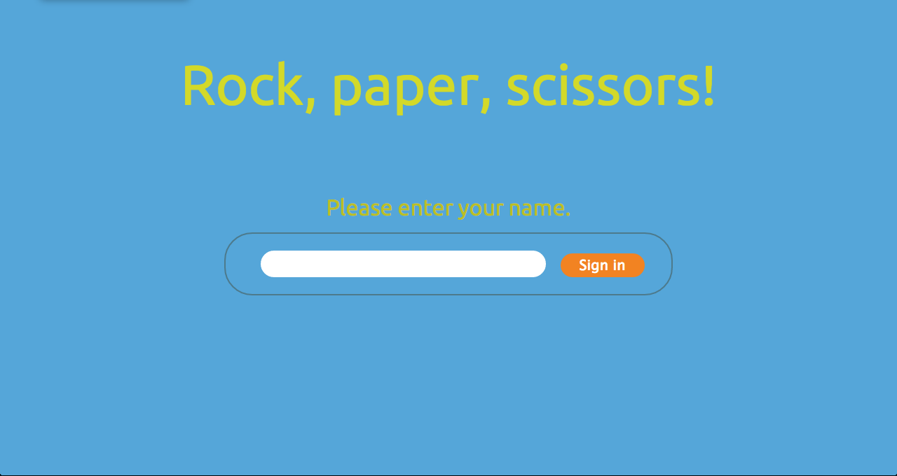

#Challenge: Rock, Paper, Scissors

#Objective
Provide a Rock, Paper, Scissors game to be played in the web with the following features:
    - The player has to enter a name to play
    - The player should choose from the presented options(rok, paper and scissors)
    - The game will choose a random option
    - A winner will be declared
Basic Rules
* Rock beats Scissors
* Scissors beats Paper
* Paper beats Rock

##Extras

###Multiplayer
* Change the game so that two players can play against each other

#Technologies used
    - Ruby
    - Sinatra
    - CSS/Html
    
#How it works
Access the site in Heroku: https://ana-rps.herokuapp.com/

